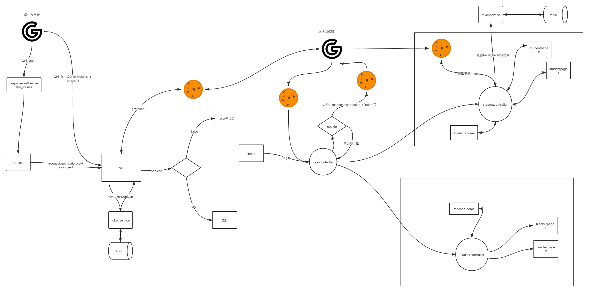

[toc]

# 网约车

## 介绍
打车软件

用户:注册登录.

乘客端:打车,查看订单,钱包支付提现

司机端:接单,导航,查看订单,钱包支付提现

## 软件架构

### 架构图说明:

架构图-1是原计划,架构图-2是目前项目.

#### 客户端:

​	user:统一登录注册入口

​	passenger:乘客端

​	driver:司机端

#### 服务端:

##### 	authenservice:

​	token存取,认证.可复用.

​	token校验流程图

##### 	userservice:

​	用户注册登录.可复用.

​	微信登录调起第三方登录系统api.

​    微信登录流程图

##### 	orderservice:

​	订单服务

​	系统派单流程图:

##### 	walletservice:

​	钱包服务

##### 	payservice:

​	支付服务,调起第三方支付系统api

​    支付调用流程图

​	[微信支付:](https://pay.weixin.qq.com/wiki/doc/api/app/app.php?chapter=8_3)

​	[支付宝支付:](https://opendocs.alipay.com/support/01rfu7?ant_source=opendoc_recommend)

##### 	mapservice:

​	地图服务,调起[第三方地图服务系统api服务](	https://lbsyun.baidu.com/index.php?title=webapi):地图服务,GPS+LBS定位服务,路线规划,导航服务,预估里程,用时服务,实时里程,计算服务等.

​    百度地图调用流程图:

##### 	saveservice:

​	1.读取mysql数据至redis,实现快速查询.

​	2.使用rabbitmq异步存数据到redis,同步至mysql.

​	数据库存取流程图:

#### 架构图-1

#### 架构图-2

### 技术栈

- 接口文档
  YAPI,mongodb

- 前端

  bootsrtap,ajax,thymleaf,jquery

- 后端
  springmvc 

  spring cloud：eureka hystrix zuul

  openfeign,ribbon,rabbitmq,jwt

  mybatis

- 数据库

  mysql  

  redis 

- 测试

  文档:YAPI,参见http://www.foodiesquad.top:3000

  功能:selenium

  性能:jmtter 

  安全:appscan
  
- 部署

  K8s,docker

## 安装教程

1.  运行jar包,请参考jar包运行分支

## 使用说明

1.  运行jar包,请参考jar包运行分支

